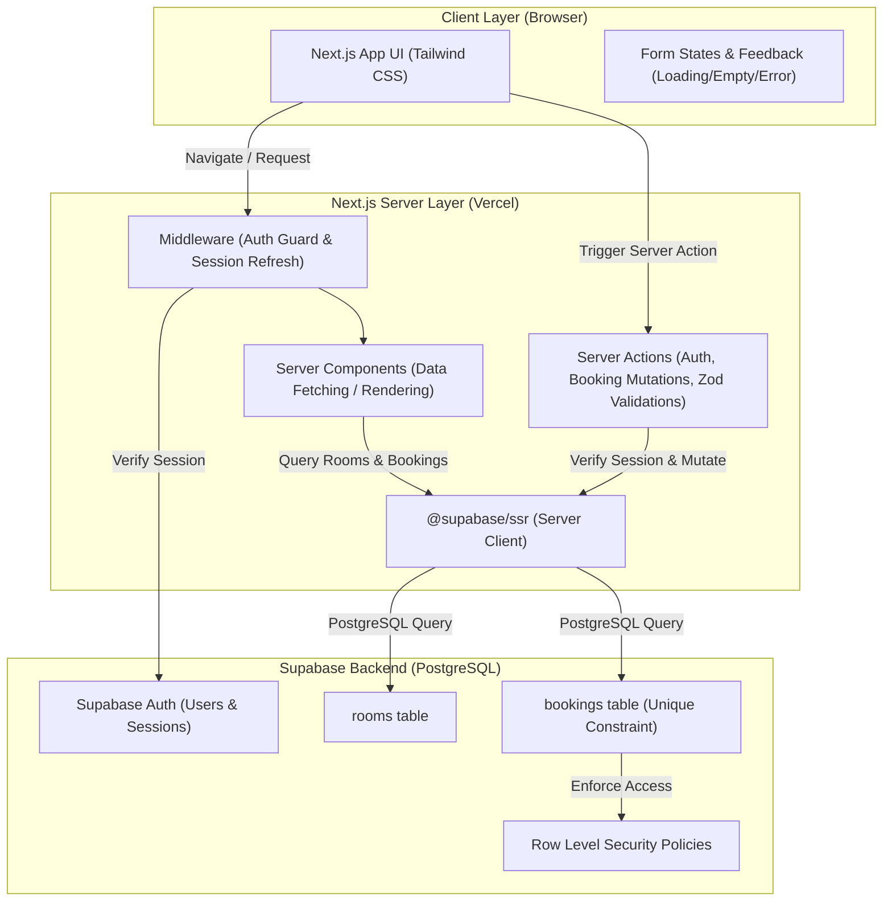

# ระบบจองห้องอ่านหนังสือมหาวิทยาลัย (University Study Room Booking System)

ระบบเว็บแอปพลิเคชันสำหรับจองห้องอ่านหนังสือและห้องศึกษากลุ่มของมหาวิทยาลัย พัฒนาตามข้อกำหนดของ **Capstone Workshop: Vibe Coding + Database** โดยเน้นความปลอดภัยในระดับฐานข้อมูล (PostgreSQL Constraints & Row Level Security), สถาปัตยกรรม Next.js App Router (Server Components & Server Actions) และการออกแบบ UI/UX ที่ทันสมัย ใช้งานง่าย

---

## 🚀 Tech Stack

- **Frontend & Framework:** [Next.js](https://nextjs.org/) (App Router, TypeScript)
- **Styling & UI:** [Tailwind CSS](https://tailwindcss.com/), [Lucide React](https://lucide.dev/)
- **Backend & Database:** [Supabase](https://supabase.com/) (PostgreSQL, Supabase Auth, Row Level Security)
- **Validation:** [Zod](https://zod.dev/)
- **Deployment:** [Vercel](https://vercel.com/)

---

## 🏛️ สถาปัตยกรรมระบบ (Architecture Overview)



---

## 🗄️ โครงสร้างฐานข้อมูล (Database Schema & Security)

### ตาราง `public.rooms` (รายชื่อห้องอ่านหนังสือ)
- `id` (UUID, Primary Key)
- `name` (TEXT): ชื่อห้อง
- `capacity` (INT): ความจุที่นั่ง
- `location` (TEXT): สถานที่ / ชั้น / อาคาร
- `description` (TEXT): รายละเอียดห้อง
- `amenities` (TEXT[]): สิ่งอำนวยความสะดวก
- `is_active` (BOOLEAN): สถานะเปิดใช้งาน

### ตาราง `public.bookings` (รายการจองห้อง)
- `id` (UUID, Primary Key)
- `user_id` (UUID, Foreign Key -> `auth.users(id)`)
- `room_id` (UUID, Foreign Key -> `public.rooms(id)`)
- `booking_date` (DATE): วันที่จอง
- `time_slot` (TEXT): รอบเวลา (เช่น `09:00-11:00`, `11:00-13:00`, `13:00-15:00`, `15:00-17:00`, `17:00-19:00`)
- `purpose` (TEXT): วัตถุประสงค์การใช้งาน
- `status` (TEXT): สถานะการจอง (`confirmed` หรือ `cancelled`)

### 🔒 กติกาความปลอดภัยและ Concurrency Guard
1. **ป้องกันการจองซ้ำ (Anti-Double Booking):** ใช้ Partial Unique Index บน PostgreSQL
   ```sql
   CREATE UNIQUE INDEX unique_active_room_date_slot 
   ON public.bookings (room_id, booking_date, time_slot) 
   WHERE status = 'confirmed';
   ```
2. **Row Level Security (RLS):**
   - ผู้ใช้ทุกคนที่ล็อกอินสามารถอ่านข้อมูลห้อง (`rooms`) และการจองที่ยืนยันแล้ว (`bookings`) เพื่อตรวจสอบช่วงเวลาว่าง
   - ผู้ใช้สามารถสร้าง แก้ไข หรือยกเลิกได้เฉพาะรายการจองที่ตนเองเป็นเจ้าของ (`auth.uid() = user_id`) เท่านั้น
3. **Session Verification:** ฝั่ง Server ดึง `user_id` จาก `supabase.auth.getUser()` เสมอ (ไม่รับ `user_id` จาก Request Form)

---

## ⚙️ ขั้นตอนการติดตั้งและรันโปรเจกต์ (Setup Guide)

### 1. ติดตั้ง Dependencies
```bash
npm install
```

### 2. ตั้งค่าฐานข้อมูลบน Supabase
1. เข้าไปที่ [Supabase Dashboard](https://supabase.com/dashboard) และสร้างโปรเจกต์ใหม่
2. เปิดเมนู **SQL Editor**
3. คัดลอกโค้ดจากไฟล์ `supabase/schema.sql` แล้วกด **Run** เพื่อสร้างตาราง, Index และ RLS Policies
4. คัดลอกโค้ดจากไฟล์ `supabase/seed.sql` แล้วกด **Run** เพื่อใส่ข้อมูลห้องอ่านหนังสือเริ่มต้น

### 3. ตั้งค่า Environment Variables
สร้างไฟล์ `.env.local` ใน Root directory และระบุค่าจาก Supabase Dashboard (**Project Settings > API**):
```env
NEXT_PUBLIC_SUPABASE_URL=https://your-project-id.supabase.co
NEXT_PUBLIC_SUPABASE_ANON_KEY=your-anon-key
```

### 4. รันโปรเจกต์สำหรับ Development
```bash
npm run dev
```
เปิดบราวเซอร์ที่ `http://localhost:3000`

### 5. บัญชีสำหรับทดสอบระบบ (Test User Account)
สามารถใช้บัญชีทดสอบนี้เข้าสู่ระบบเพื่อตรวจประเมินได้ทันที:
- **Email:** `test@local.com`
- **Password:** `123456789`

---

## 🌐 การ Deploy บน Vercel (Production)

1. Push โค้ดขึ้น GitHub Repository
2. Import repository เข้าสู่ [Vercel](https://vercel.com/)
3. เพิ่ม Environment Variables บน Vercel Project Settings:
   - `NEXT_PUBLIC_SUPABASE_URL`
   - `NEXT_PUBLIC_SUPABASE_ANON_KEY`
4. บน Supabase Dashboard (**Authentication > URL Configuration**):
   - กำหนด **Site URL** และ **Redirect URLs** ให้ตรงกับ Production Domain ของ Vercel (เช่น `https://your-app.vercel.app`)

---

## ✅ ตารางผลการทดสอบ (Acceptance Tests Checklist)

| # | ข้อกำหนด (Acceptance Test) | ผลการตรวจสอบ |
|---|---|---|
| **01** | สมัครและเข้าสู่ระบบด้วย email/password ได้ | ✅ ผ่าน (รองรับ Supabase Auth Email/Password พร้อม Session) |
| **02** | ผู้ที่ยังไม่เข้าสู่ระบบถูกนำไปหน้า login | ✅ ผ่าน (ป้องกันผ่าน Next.js `middleware.ts`) |
| **03** | ห้องถูกอ่านจาก Supabase ไม่ใช่ hard-coded array | ✅ ผ่าน (Query จากตาราง `rooms` ผ่าน Server Component) |
| **04** | สร้าง booking แล้วข้อมูลยังอยู่หลัง refresh | ✅ ผ่าน (บันทึกและดึงจาก PostgreSQL บน Supabase) |
| **05** | แก้ไขและลบ booking ของตนเองได้ | ✅ ผ่าน (มีฟังก์ชันแก้ไขวัตถุประสงค์ และ Soft Delete ยกเลิกการจอง) |
| **06** | ผู้ใช้คนที่สองแก้ไข booking ของผู้ใช้คนแรกไม่ได้ | ✅ ผ่าน (ป้องกันด้วย RLS และเงื่อนไข `user_id = user.id`) |
| **07** | room/date/slot ซ้ำถูก database ปฏิเสธ | ✅ ผ่าน (บังคับด้วย Unique Index `unique_active_room_date_slot`) |
| **08** | ฟอร์มที่ข้อมูลไม่ครบถูกปฏิเสธ | ✅ ผ่าน (ตรวจสอบด้วย Zod Schema ทั้ง Client และ Server Action) |
| **09** | Database error ถูกแปลงเป็นข้อความที่ผู้ใช้เข้าใจได้ | ✅ ผ่าน (ดักจับ Error 23505 และแสดงข้อความเตือนภาษาไทย) |
| **10** | Repository ไม่มี secret หรือ service-role key | ✅ ผ่าน (มีเฉพาะ `NEXT_PUBLIC_` keys, ซ่อน `.env*.local` ใน `.gitignore`) |
| **11** | Production URL ทำงานโดยไม่พึ่ง localhost | ✅ ผ่าน (Build & SSR พร้อมรองรับการรันบน Vercel) |
| **12** | Login callback และ environment variables ทำงานบน Vercel | ✅ ผ่าน (ตั้งค่า Redirect URL และ Environment Variables มาตรฐาน) |
